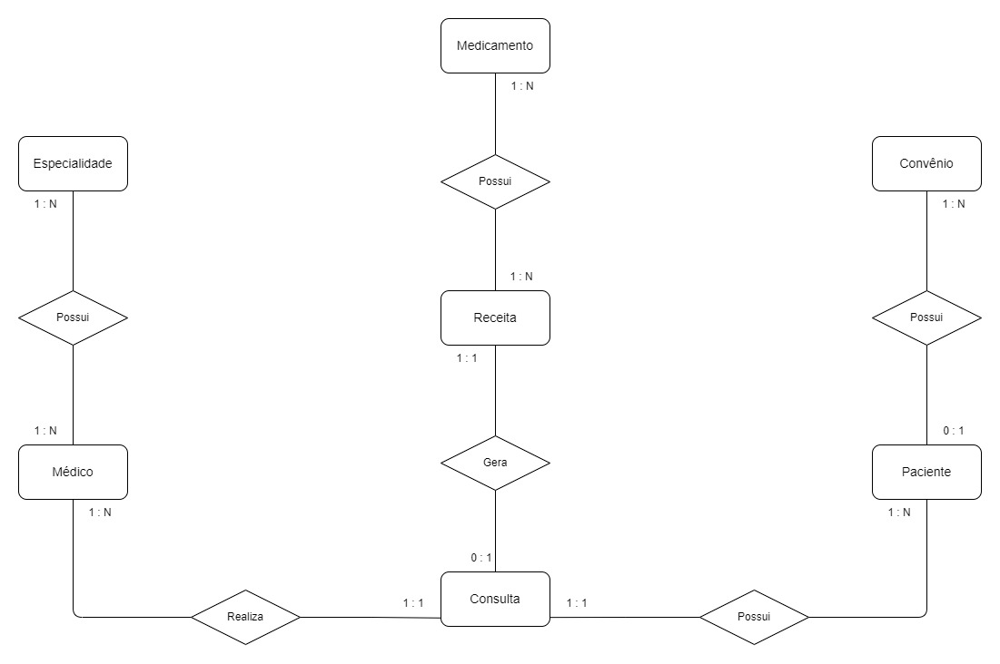
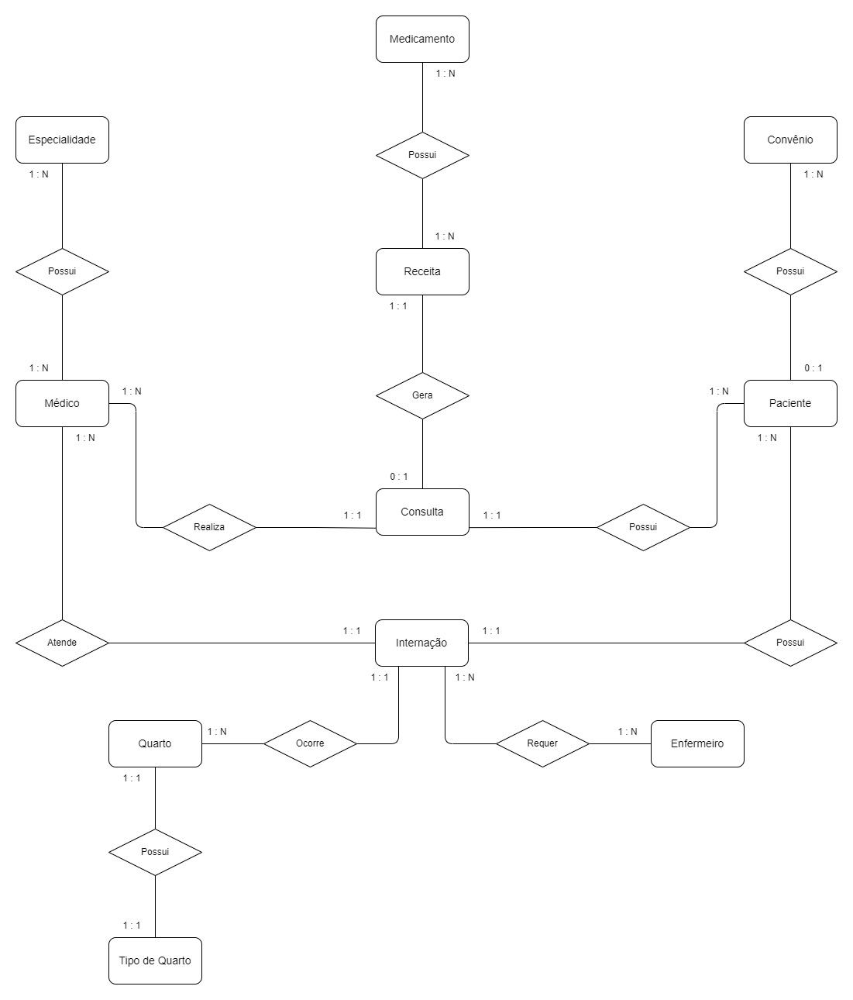
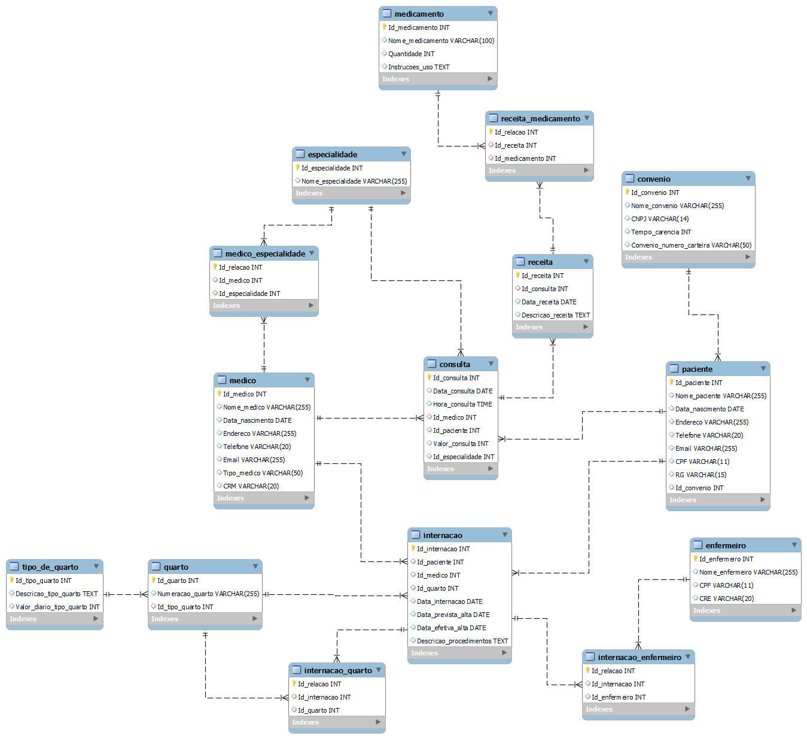

# 🏥 O Hospital Fundamental
Sistema de Gestão Hospitalar

## 📄 Sobre o Projeto
Este projeto visa criar um sistema de banco de dados para um pequeno hospital local, substituindo o uso atual de planilhas e arquivos físicos. Será feita uma análise das necessidades do hospital para sugerir uma estrutura de banco de dados eficiente, facilitando a gestão de pacientes, médicos, prontuários, agendamentos e outros aspectos fundamentais.

> ### Parte 1
> Modelo Conceitual

## 📊 Entidades
Aqui estão as entidades principais do sistema:

- 🩺 **Médico**
- 🏷️ **Especialidade**
- 👥 **Paciente**
- 📑 **Convênio**
- 📅 **Consulta**
- 💊 **Receita**
- 💉 **Medicamento**

## 🔗 Relacionamentos
Os principais relacionamentos entre as entidades são:

- **Médico - Especialidade**: Um médico pode ter uma ou mais especialidades, e uma especialidade pode ser associada a muitos médicos.
- **Paciente - Convênio**: Um paciente pode ter um convênio, e um convênio pode ser associado a muitos pacientes.
- **Consulta - Médico - Paciente**: Uma consulta é realizada por um médico para um paciente.
- **Consulta - Receita**: Uma consulta pode ter uma receita associada.
- **Receita - Medicamento**: Uma receita pode incluir um ou mais medicamentos, e um medicamento pode estar presente em muitas receitas.

## 🌐 Diagrama Entidade-Relacionamento

> ### Parte 2
> Atualização do Diagrama  
> Modelo Lógico

## 📊 Entidades Atualizadas
Aqui estão as entidades atualizadas do sistema:

- 🛏️ **Internação**
- 🏨 **Quarto**
- 🛏️ **Tipo de Quarto**
- 👩‍⚕️ **Enfermeiro**

## 🔗 Relacionamentos Atualizados
Os relacionamentos atualizados entre as entidades são:

- **Internação - Paciente**: Um paciente pode ter múltiplas internações.
- **Internação - Médico**: Uma internação é vinculada a um único médico responsável.
- **Internação - Quarto**: Uma internação é vinculada a um quarto.
- **Quarto - Tipo de Quarto**: Um quarto pertence a um tipo de quarto.
- **Internação - Enfermeiro**: Vários enfermeiros podem estar responsáveis por uma internação.

## 🌐 Diagrama Entidade-Relacionamento Atualizado

## 🌐 Modelo Lógico

