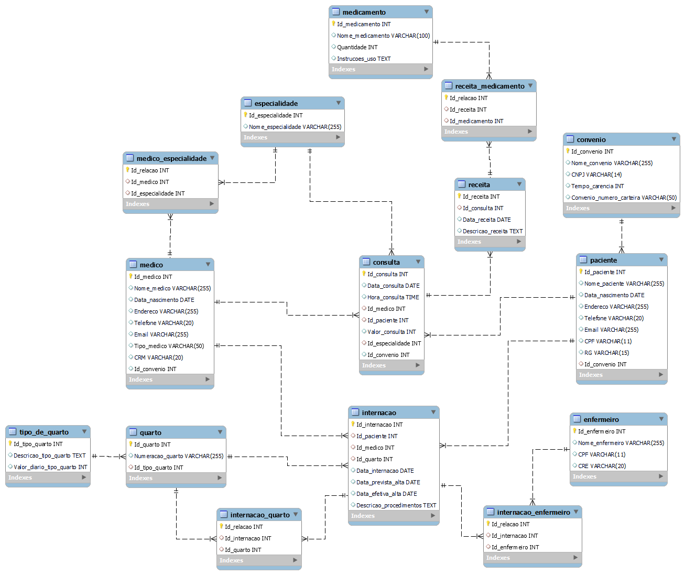

# 🏥 O Hospital Fundamental
Sistema de Gestão Hospitalar

## 📄 Sobre o Projeto
Este projeto visa criar um sistema de banco de dados para um pequeno hospital local, substituindo o uso atual de planilhas e arquivos físicos. Será feita uma análise das necessidades do hospital para sugerir uma estrutura de banco de dados eficiente, facilitando a gestão de pacientes, médicos, prontuários, agendamentos e outros aspectos fundamentais.

> ### Parte 1
> **Modelo Conceitual**

## 📊 Entidades
Aqui estão as entidades principais do sistema:

- 🩺 **Médico**
- 🏷️ **Especialidade**
- 👥 **Paciente**
- 📑 **Convênio**
- 📅 **Consulta**
- 💊 **Receita**
- 💉 **Medicamento**

## 🔗 Relacionamentos
Os principais relacionamentos entre as entidades são:

- **Médico - Especialidade**: Um médico pode ter uma ou mais especialidades, e uma especialidade pode ser associada a muitos médicos.
- **Paciente - Convênio**: Um paciente pode ter um convênio, e um convênio pode ser associado a muitos pacientes.
- **Consulta - Médico - Paciente**: Uma consulta é realizada por um médico para um paciente.
- **Consulta - Receita**: Uma consulta pode ter uma receita associada.
- **Receita - Medicamento**: Uma receita pode incluir um ou mais medicamentos, e um medicamento pode estar presente em muitas receitas.

## 🌐 Diagrama Entidade-Relacionamento


> ### Parte 2
> **Atualização do Diagrama** <br/>
> **Modelo Lógico**

## 📊 Entidades Atualizadas
Aqui estão as entidades atualizadas do sistema:

- 🛏️ **Internação**
- 🏨 **Quarto**
- 🛏️ **Tipo de Quarto**
- 👩‍⚕️ **Enfermeiro**

## 🔗 Relacionamentos Atualizados
Os relacionamentos atualizados entre as entidades são:

- **Internação - Paciente**: Um paciente pode ter múltiplas internações.
- **Internação - Médico**: Uma internação é vinculada a um único médico responsável.
- **Internação - Quarto**: Uma internação é vinculada a um quarto.
- **Quarto - Tipo de Quarto**: Um quarto pertence a um tipo de quarto.
- **Internação - Enfermeiro**: Vários enfermeiros podem estar responsáveis por uma internação.

## 🌐 Diagrama Entidade-Relacionamento Atualizado


## 🌐 Modelo Lógico



> ### Parte 3
> **Alimentação do Database** <br/>
> **Modelo Físico** 

## 🌐 Modelo Físico
Nesta etapa, foram desenvolvidos scripts SQL para criar e povoar as tabelas do banco de dados do Hospital Fundamental, de acordo com o modelo lógico.

## 🥼 Criação do Banco de Dados 
Exemplo da criação da Tabela Espcialidade:

```sql
CREATE TABLE IF NOT EXISTS Especialidade (
    Id_especialidade INT AUTO_INCREMENT PRIMARY KEY,
    Nome_especialidade VARCHAR(255)
);
```
🔗 [Hospital.sql](https://github.com/EmillyMLFreitas/O_Hospital_Fundamental/blob/main/Hospital.sql)

## 🧑🏽‍⚕ Povoamento do Banco de Dados 
Exemplo da inserção de dados na Tabela Espcialidade:

```sql
INSERT INTO especialidade (Nome_especialidade) VALUES 
('Pediatria'),
('Clínica Geral'),
('Gastrenterologia'),
('Dermatologia'),
('Cardiologia'),
('Neurologia'),
('Oftalmologia');
```
🔗 [Hospital_Povoamento.sql](https://github.com/EmillyMLFreitas/O_Hospital_Fundamental/blob/main/Hospital_Povoamento.sql)

> ### Parte 4
> **Alterando o banco de dados**

## 🛠️ Alterações e Atualizações
Nesta parte, realizamos modificações no banco de dados existente para aprimorar o sistema do Hospital Fundamental.

## 🔄 Adição da Coluna "em_atividade"
Adicionada uma coluna "em_atividade" à tabela Medico, indicando se o médico está atuando ou não no hospital.

```sql
ALTER TABLE Medico 
ADD COLUMN em_atividade BOOLEAN DEFAULT true;
```

## 📝 Atualização do Status dos Médicos
Atualizados pelo menos dois médicos como inativos e os demais como ativos.

```sql
UPDATE Medico
SET em_atividade = false
WHERE Id_medico IN (1,5);
```

```sql
UPDATE Medico
SET em_atividade = true
WHERE Id_medico NOT IN (1,5);
```

🔗 [Hospital_Alteracao.sql](https://github.com/EmillyMLFreitas/O_Hospital_Fundamental/blob/main/Hospital_Alteracao.sql)
